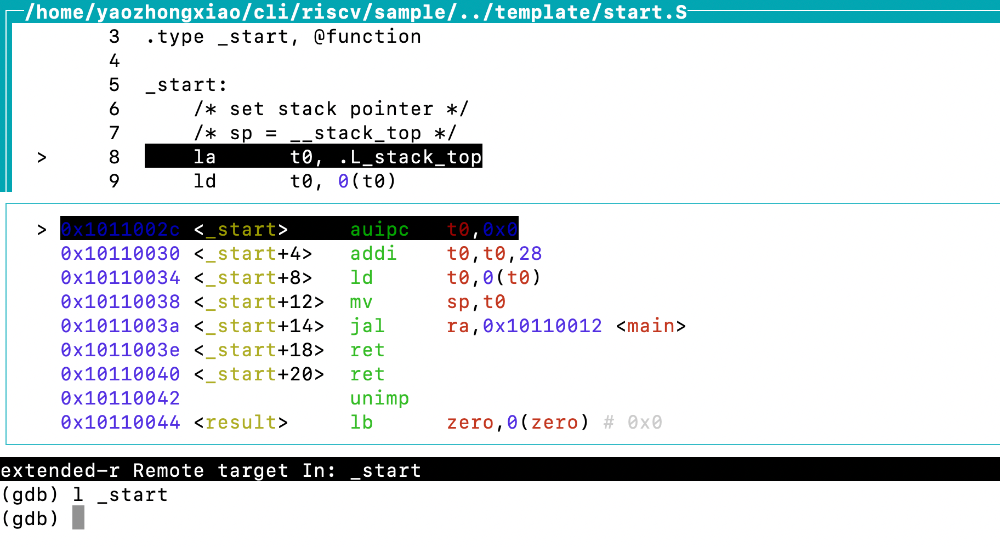
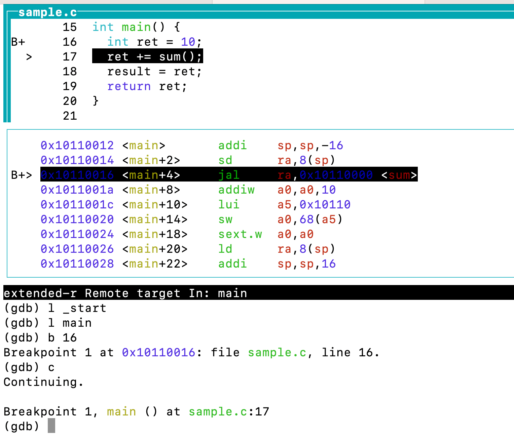

# risc-v tools
tools for risc-v development and debugging

## 1. riscv develop toolchain

### 1.1 riscv-tools-builder
riscv-tools-builder will build and install the following risc-v tools.
All the tools will build by their own builder.
- spike
- pk
- riscv64-unknown-elf tool-chains(riscv64-unknown-elf-gcc, etc.)
- riscv64-openocd

#### 1.1.1 riscv64-unknown-elf-builder
riscv64-unknown-elf-builder will download, build and install the riscv64-unknown-elf tool-chains, such as riscv64-unknown-elf-gcc, riscv64-unknown-elf-gdb, etc.

The detailed information refer to the docs [RISC-V GNU Compiler Toolchain](https://github.com/riscv-collab/riscv-gnu-toolchain)

#### 1.1.2 spike-builder
spike-builder will download, build and install the risc-v sim "spike"

The detailed information refer to the docs [Spike RISC-V ISA Simulator](https://github.com/riscv-software-src/riscv-isa-sim)

#### 1.1.3 spike-pk-builder
spike-pk-builder will download, build and install the risc-v sim proxy kernel "spike pk"

The detailed information refer to the docs [RISC-V Proxy Kernel and Boot Loader](https://github.com/riscv-software-src/riscv-pk)

#### 1.1.4 openocd-builder
openocd-builder will download, build and install the openocd for spike debugger proxy.
The detailed information refer to the following links:
- [riscv-openocd](https://github.com/riscv/riscv-openocd)
- [Spike+OpenOCD](https://zhuanlan.zhihu.com/p/301577545)
- [RISC-V debug system and simulation](https://zhuanlan.zhihu.com/p/125145986)


### 1.2 risc-v compiler
risc-v compiler will build the source code into risc-v executable binary which can execute in risc-v simulator spike(spike pk)

#### 1.2.1 rvcc
rvcc(risc-v c compiler) is a wrapper for riscv64-unknown-elf-gcc together with linker script and "start.s".
rvcc will help developer to easily build risc-v excutable from source with the following command.
```
../rvcc -g -Og sample.c -o sample

```
#### rv++
rv++(risc-v c++ compiler) is a wrapper for riscv64-unknown-elf-g++ together with linker script and "start.s".
rv++ will help developer to easily build risc-v excutable from source with the following command.
```
../rv++ -g -Og sample.cc -o sample

```

### 1.3 risc-v debugger

#### rdbserver
rdbserver will start the spike as riscv64-unknown-elf-gdb server listerning for rdbclient to connect with the following command.
```
rdbserver app.elf
```

#### rdbclient
rdbclient will start the riscv64-unknown-elf-gdb client to connect to rdbserver with the following command.
```
rdbclient app.elf
```

#### rdb
rdb is a wrapper for rdbserver and rdbclient. It will start the rdbserver for client connecting, then start the rdbclient to create the debugger connect with the following command.
```
    [yaozhongxiao@PC-5QXDC3 ~/cli/riscv/sample] rdb sample
    >  /home/yaozhongxiao/cli/riscv/rdb sample
    >  /home/yaozhongxiao/cli/riscv/rdbserver sample
    >  spike --rbb-port=2048 -m0x10110000:0x20000  sample
    >  /home/yaozhongxiao/cli/riscv/rdbclient sample
    >  wait spike --rbb-port
    >  remote_bitbang failed to bind socket: Address already in use (98)
    >  openocd -f /home/yaozhongxiao/cli/riscv/template/spike.cfg
    >  Open On-Chip Debugger 0.12.0+dev-gc05e4c5a2 (2023-10-03-14:48)
    >  Licensed under GNU GPL v2
    >  For bug reports, read
    >  	http://openocd.org/doc/doxygen/bugs.html
    >  Info : only one transport option; autoselecting 'jtag'
    >  Info : Initializing remote_bitbang driver
    >  Info : Connecting to localhost:2048
    >  Info : remote_bitbang driver initialized
    >  Info : Note: The adapter "remote_bitbang" doesn't support configurable speed
    >  Info : JTAG tap: riscv.cpu tap/device found: 0xdeadbeef (mfg: 0x777 (<unknown>), part:  >  0xeadb, ver: 0xd)
    >  Info : datacount=2 progbufsize=2
    >  Info : Examined RISC-V core; found 1 harts
    >  Info :  hart 0: XLEN=64, misa=0x800000000014112d
    >  Info : starting gdb server for riscv.cpu on 3333
    >  Info : Listening on port 3333 for gdb connections
    >  Info : Listening on port 6666 for tcl connections
    >  Info : Listening on port 4444 for telnet connections
    >  riscv64-unknown-elf-gdb sample -x /home/yaozhongxiao/cli/riscv/template/.rdbinit
    >  GNU gdb (GDB) 12.1
    >  Copyright (C) 2022 Free Software Foundation, Inc.
    >  License GPLv3+: GNU GPL version 3 or later <http://gnu.org/licenses/gpl.html>
    >  This is free software: you are free to change and redistribute it.
    >  There is NO WARRANTY, to the extent permitted by law.
    >  Type "show copying" and "show warranty" for details.
    >  This GDB was configured as "--host=x86_64-pc-linux-gnu --target=riscv64-unknown-elf".
    >  Type "show configuration" for configuration details.
    >  For bug reporting instructions, please see:
    >  <https://www.gnu.org/software/gdb/bugs/>.
    >  Find the GDB manual and other documentation resources online at:
    >      <http://www.gnu.org/software/gdb/documentation/>.
    >  
    >  For help, type "help".
    >  Type "apropos word" to search for commands related to "word"...
    >  Reading symbols from sample...
    >  Info : accepting 'gdb' connection on tcp/3333
    >  main () at sample.c:18
    >  18	  result = ret;
    >  Loading section .text, size 0x42 lma 0x10110000
    >  Loading section .data, size 0xc lma 0x10110044
    >  Start address 0x000000001011002c, load size 78
    >  Transfer rate: 1 KB/sec, 39 bytes/write.
    > (gdb)  -l _start
    > (gdb)  -l main
```    
- (gdb)  -l _start


- (gdb)  -l main


## template
### .rdbinit
.rdbinit is the command to execute during riscv64-unknown-elf-gdb start

### spike.cfg
spike.cfg is the configure for openocd to connect with spike sim during debugging.

### spike.lds
spike.lds is the linker script for rvcc and rv++

### start.S
start.S is the boottrap code for riscv executable